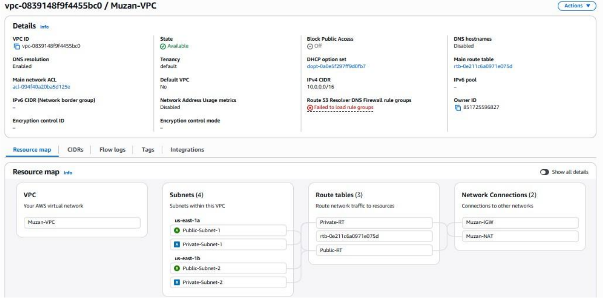
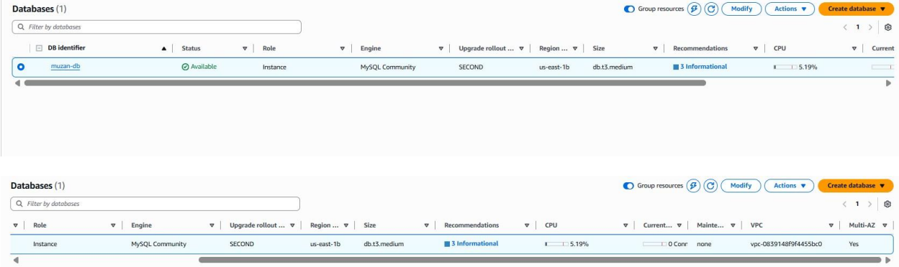
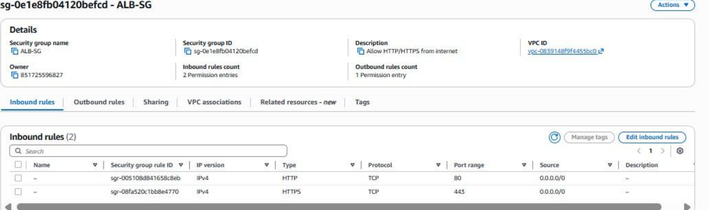
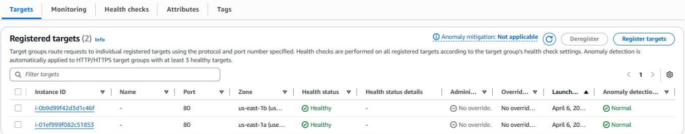
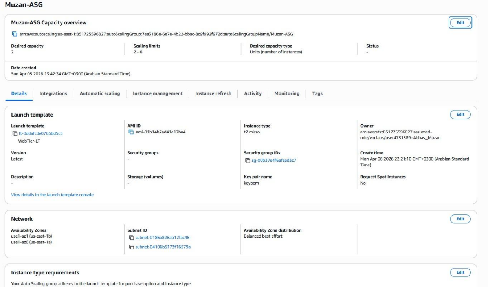
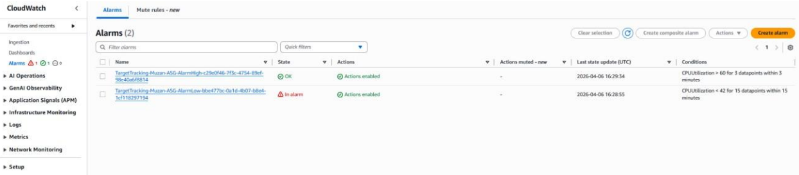

# AWS Cloud Infrastructure Deployment

**Author:** Muzan Abbas

A production-grade AWS infrastructure deployment featuring a secure, scalable, and highly available multi-tier architecture built on Amazon Web Services.

---

## Architecture Overview



```
Internet
    │
[Internet Gateway]
    │
[ALB - Public Subnets us-east-1a / us-east-1b]
    │
[EC2 Web Tier - Private Subnets]  ←→  [Auto Scaling Group: min 2, max 6]
    │
[RDS MySQL - Multi-AZ, Private Subnets only]
```

---

## Section 1 – VPC & Networking

The VPC is built on CIDR `10.0.0.0/16` and spans two Availability Zones for high availability. It contains 4 subnets — 2 public and 2 private. Public subnets route traffic through an Internet Gateway, while private subnets use a NAT Gateway for secure outbound access only.

| Name | Type | CIDR | Availability Zone |
|---|---|---|---|
| Public-Subnet-1 | Public | `10.0.0.0/24` | us-east-1a |
| Public-Subnet-2 | Public | `10.0.2.0/24` | us-east-1b |
| Private-Subnet-1 | Private | `10.0.1.0/24` | us-east-1a |
| Private-Subnet-2 | Private | `10.0.3.0/24` | us-east-1b |

- **Internet Gateway (Muzan-IGW):** Attached to Muzan-VPC, enables public internet access
- **NAT Gateway (Muzan-NAT):** Placed in Public-Subnet-1, allows private instances to reach the internet without being exposed
- **Public-RT:** Routes `0.0.0.0/0` → IGW, associated with both public subnets
- **Private-RT:** Routes `0.0.0.0/0` → NAT Gateway, associated with both private subnets

---

## Section 2 – Security Groups

Three security groups enforce a layered security model where each tier only communicates with what it needs to.

### ALB-SG
| Direction | Protocol | Port | Source |
|---|---|---|---|
| Inbound | HTTP | 80 | `0.0.0.0/0` |
| Inbound | HTTPS | 443 | `0.0.0.0/0` |

### WebTier-SG
| Direction | Protocol | Port | Source |
|---|---|---|---|
| Inbound | HTTP | 80 | ALB-SG only |

### Database-SG
| Direction | Protocol | Port | Source |
|---|---|---|---|
| Inbound | MySQL | 3306 | WebTier-SG only |

---

## Section 3 – RDS Database



The database runs MySQL in the private subnets and is completely inaccessible from the internet. Multi-AZ is enabled for automatic failover.

| Setting | Value |
|---|---|
| Engine | MySQL Community |
| Instance Size | db.t3.medium |
| Multi-AZ | ✅ Enabled |
| Publicly Accessible | ❌ No |
| Security Group | Database-SG (port 3306 from WebTier-SG only) |
| Subnets | Private-Subnet-1 (us-east-1a), Private-Subnet-2 (us-east-1b) |

---

## Section 4 – Load Balancer & Web Tier



An internet-facing Application Load Balancer sits in the public subnets and forwards all traffic to EC2 instances running in the private subnets. The web servers are never directly exposed to the internet.

| Setting | Value |
|---|---|
| Type | Application Load Balancer |
| Scheme | Internet-facing |
| Listener | HTTP port 80 → WebTier-TG |
| Target Type | Instance |
| Healthy Targets | 2 / 2 |

| Instance | Subnet | Private IP | Status |
|---|---|---|---|
| Instance 1 | Private-Subnet-2 (us-east-1b) | 10.0.3.171 | ✅ Healthy |
| Instance 2 | Private-Subnet-1 (us-east-1a) | 10.0.1.237 | ✅ Healthy |



---

## Section 5 – Auto Scaling



The Auto Scaling Group manages EC2 instances across both private subnets and scales based on CPU utilization. CloudWatch monitors the metric and triggers scaling actions automatically.

| Setting | Value |
|---|---|
| Launch Template | WebTier-LT (t2.micro) |
| Desired Capacity | 2 |
| Minimum | 2 |
| Maximum | 6 |
| Scaling Policy | Target Tracking — CPU at 60% |
| Warmup Period | 300 seconds |



| Alarm | Condition | Action |
|---|---|---|
| Scale Out | CPU ≥ 60% for 3 datapoints | Add instances |
| Scale In | CPU < 42% for 15 datapoints | Remove instances |

---

## Conclusion

The infrastructure is designed to be secure, scalable, and highly available. Public and private resources are fully separated, traffic flows only through defined paths, and the system automatically adjusts capacity based on real demand. All components are deployed across two Availability Zones to eliminate single points of failure.
